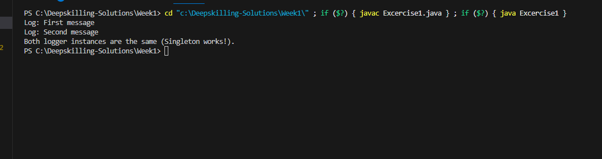
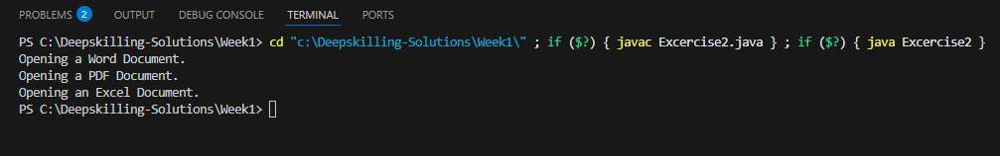
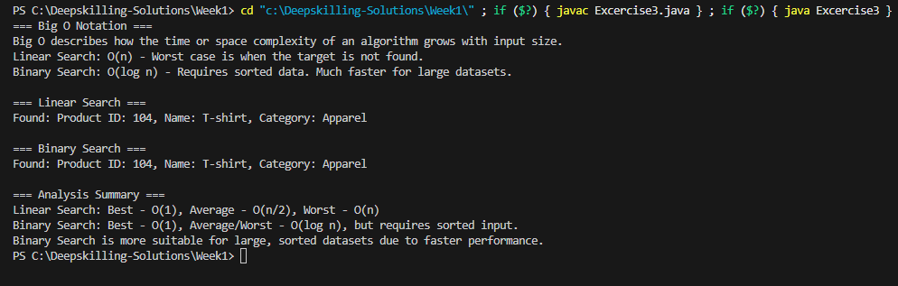
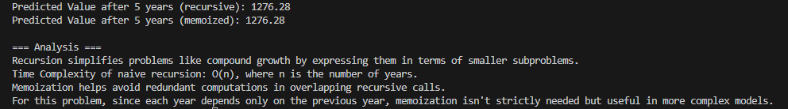
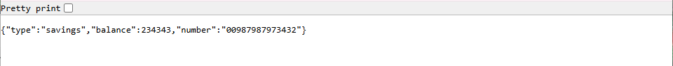
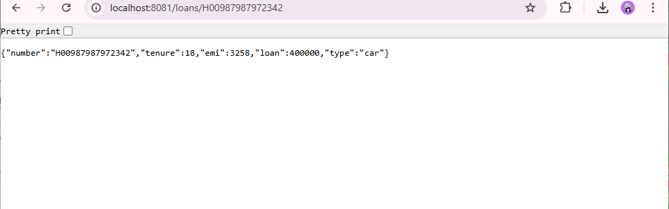

# Cognizant Digital Nurture 4.0 - Weekly Solutions Repository

This repository contains my weekly solutions for the **Cognizant Digital Nurture 4.0 Program**.  
Each week, I will upload the solutions to the assigned exercises, covering a range of topics including design patterns, algorithms, PL/SQL, unit testing, mocking, and logging.

---

## 📚 Week 1

### 1️⃣ Design Principles & Patterns

#### Exercise 1: Implementing the Singleton Pattern
- [Solution Link](https://github.com/Bhavani573/Java-FSE-DeepSkilling-Solutions/blob/main/Week1/Excercise1.java)
- **Output:**
  

#### Exercise 2: Implementing the Factory Method Pattern
- [Solution Link](https://github.com/Bhavani573/Java-FSE-DeepSkilling-Solutions/blob/main/Week1/Excercise2.java)
- **Output:**
  

---

### 2️⃣ Data Structures and Algorithms

#### Exercise 2: E-commerce Platform Search Function
- [Solution Link](https://github.com/Bhavani573/Java-FSE-DeepSkilling-Solutions/blob/main/Week1/Excercise3.java)
- **Output:**
  

#### Exercise 7: Financial Forecasting
- [Solution Link](https://github.com/Bhavani573/Java-FSE-DeepSkilling-Solutions/blob/main/Week1/Excercise4.java)
- **Output:**
  

---

## 🗂️ Week 2

### 1️⃣ PL/SQL Programming

#### Exercise 1: Control Structures
- [Solution Link](https://github.com/Bhavani573/Java-FSE-DeepSkilling-Solutions/blob/main/Week2/Week_2%20Handson/PLSQL_Control%20Structures.sql)
- **Output:**
  

#### Exercise 3: Stored Procedures
- [Solution Link](https://github.com/Bhavani573/Java-FSE-DeepSkilling-Solutions/blob/main/Week2/Week_2%20Handson/PLSQL_Stored%20Procedures.sql)
- **Output:**
  

---

### 2️⃣ TDD using JUnit5 and Mockito

#### Exercise 1: Setting Up JUnit
#### Exercise 3: Assertions in JUnit
#### Exercise 4: Arrange-Act-Assert Pattern, Test Fixtures, Setup and Teardown Methods

- [Solution Link](https://github.com/Bhavani573/Java-FSE-DeepSkilling-Solutions/blob/main/Week2/Week2_JUnitBasic_testingExercises.docx)

#### Exercise 1: Mocking and Stubbing (Mockito)
#### Exercise 2: Verifying Interactions (Mockito)

- [Solution Link](https://github.com/Bhavani573/Java-FSE-DeepSkilling-Solutions/blob/main/Week2/Week2_Mockito_exercise.docx)

---

### 3️⃣ SLF4J Logging Framework

#### Exercise 1: Logging Error Messages and Warning Levels
- [Solution Link](https://github.com/Bhavani573/Java-FSE-DeepSkilling-Solutions/blob/main/Week2/Week2_SLF4J_logging_exercisesdocx.docx)

---

## 📘 Week 3

### 🟢 Spring Core and Maven

#### Exercise 1: Configuring a Basic Spring Application
- [Solution Link](https://github.com/Bhavani573/Java-FSE-DeepSkilling-Solutions/tree/main/Week3/Spring%20Core%20Maven/Exercise%201%20Configuring%20a%20Basic%20Spring%20Application/src/main/java/com/library/repository)

#### Exercise 2: Implementing Dependency Injection
- [Solution Link](https://github.com/Bhavani573/Java-FSE-DeepSkilling-Solutions/tree/main/Week3/Spring%20Core%20Maven/Exercise%202%20Implementing%20Dependency%20Injection/src/main/java/com/library/repository)

#### Exercise 4: Creating and Configuring a Maven Project
- [Solution Link](https://github.com/Bhavani573/Java-FSE-DeepSkilling-Solutions/tree/main/Week3/Spring%20Core%20Maven/Exercise%204%20Creating%20and%20Configuring%20a%20Maven%20Project)

---

### 🟢 Spring Data JPA with Spring Boot and Hibernate

#### Spring Data JPA - Quick Example
- [Solution Link](https://github.com/Bhavani573/Java-FSE-DeepSkilling-Solutions/tree/main/Week3/Spring%20data_jpa_handson/Spring%20Data%20Jpa-Quick%20Example)
- **Output:**
  

#### Difference between JPA, Hibernate and Spring Data JPA
- [Solution Link](https://github.com/Bhavani573/Java-FSE-DeepSkilling-Solutions/blob/main/Week3/Spring%20data_jpa_handson/JPA_Hibernate_SpringDataJPA_Comparison.docx)
- **Output:**
  

  .png)

## 📘 Week 4

### 🟢 Spring REST using Spring Boot 3

#### Exercise 1: Create a Spring Web Project using Maven  
#### Exercise 2: Load Country from Spring Configuration XML  
#### Exercise 3: Hello World RESTful Web Service  
#### Exercise 4: REST - Country Web Service  
#### Exercise 5: REST - Get country based on country code  
#### Exercise 6: Create authentication service that returns JWT  

- [Solution Link](https://github.com/Bhavani573/Java-FSE-DeepSkilling-Solutions/tree/main/Week4)

---

## 📘 Week 5

### 🟢 Microservices with Spring Boot 3 and Spring Cloud

#### Exercise 1: Creating Microservices for Account and Loan  
- [Solution Link](https://github.com/Bhavani573/Java-FSE-DeepSkilling-Solutions/tree/main/Week5)  
- **Output:**  

### Account
    

  ### Loan
  

## 🙏 Thank You

Thank you for taking the time to explore my repository.  
Feel free to reach out if you have any questions or suggestions!

---
